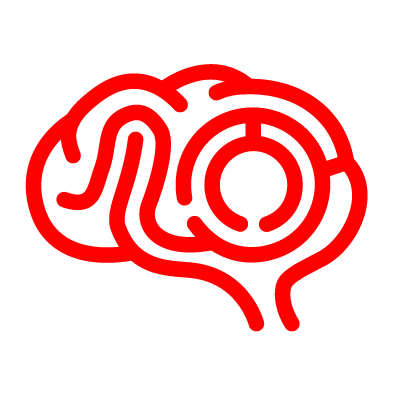
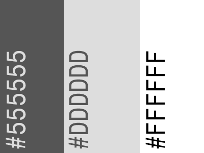

# 

# AMaze.me

AMaze.me is a memory game designed to help improve spatial memory. The idea was inspired by the Mind Field episode ["Your Brain on Tech" (S2:E4)](https://www.youtube.com/watch?v=1RHsAUyFCAM), specifically the maze section. I have also long been fascinated by the early 3D engine techniques used by games such as "Wolfenstein 3D" and "Rise of the Triad", which are uniquely suited for maze, catacomb and dungeon style 3D games. I was curious if I could reimplement the "raycasting" technique myself in Javascript.

AMaze.me requires the player to remember the position of objects in a maze and the route to get to them. They are presented with a random order in which to collect these objects, and judged on time, with the object being to improve their timings. The object is to improve memory while having fun.

[See live project](https://seanyoung247.github.io/Second-milestone-project/) 

## Contents

## UX (User Experience)

### Project Goals

The project goal is to produce a game that helps improve memory while being fun to play.

### User Stories

- As a **player** I want a **clear explanation** of how to play the game.
- As a **player**, I want an obvious way to **adjust the game** to my level of expertise.
- As a **player**, I want to be able to **learn the game** before I play.
- As a **player**, I want **clear** **feedback** on my goals while I play.
- As a **player**, I want **clear feedback** on my progress while I play.
- As a **player**, I want to get **clear feedback** when I win.

## Design

### Fonts

All fonts are sourced from [google fonts](https://fonts.google.com/).

[Roboto](https://fonts.google.com/specimen/Roboto) is used for site UI and text because it is a simple easy to read font.

[Orbitron](https://fonts.google.com/specimen/Orbitron) is used for the in game title bar clock. This was chosen as it is easy to read and is reminiscent of a digital clock. Only the numbers and ':' character are imported as it is only used for the clock.

[Permanent Marker](https://fonts.google.com/specimen/Permanent+Marker) is used for game generated messages because it is a visually interesting font that lends itself to the "hand drawn" aesthetic of the game.

### Colours

A simple monochromatic colour scheme was chosen for the site UI. This was chosen as it provides strong contrast for interface elements while also being unobtrusive during gameplay.

* Dark grey (#555555) - UI Background
* Light grey (#DDDDDD) - UI Highlights
* White (#FFFFFF) - Text colour

Further the engine uses some other CSS colours to draw a basic "skybox". The ground colour is #76552B while the sky is a gradient blending from #3190C5 to #ADD8E6.

### Layout

Site mock-ups were designed in Balsamiq. These were used to guide the layout of the page and UI. A simple and fluid layout was used to smoothly support various different screen sizes and layouts with minimal design changes for different screen sizes.

#### Original layout

The original layout was two columns with a header and menu bar. The left hand column took most of the screen for the main game canvas with the right hand column showing game messages, current play goal and minimap.

[Original layout](assets/wireframes/gamescreen-old.png)

#### Final layout

[Splash screen](assets/wireframes/splashscreen.png)

[Game screen](assets/wireframes/gamescreen.png)

The final layout differs from the original design. The two column layout was changed to a simple single column layout with most of the second column's content moved to in game overlays. This change made the game more responsive to different screen sizes while aiding immersion while playing.

## Features

The game is currently primarily aimed at desktop usage with keyboard input. Ultimately the ability for users to define custom controls will be added, but this feature is not yet implemented. The controls are:

W and S for moving forward and backward. A and D for turning left and right. The Arrow keys double as alternatives to these. Z and X can also be used to side step or "strafe". Objects can be picked up by pressing the E key or space bar. The game can be paused by either opening the main menu/splashscreen or pressing P.

There are some basic touch inputs and the site has been verified to work on mobile devices. 

### Existing Features

- On load the user is presented with a splash screen.
  - This screen has clear instructions for playing the game.
  - There are obvious controls for difficulty level and starting the game in learn and play mode.
- The game presents feedback to the user during play.
- The game presents clear instructions about the current goal during play.
- The game presents a message with the total game time when the maze is completed.

### Features Left to Implement

There are a number of features that would add to the project and aid in fulfilling user requirements:

- Better touch controls and mobile support
- Mouse look
- User settings
  - Control settings
  - Colour schemes
  - Game texture themes
- Alternative game maps
- Persistent storage
  - User settings
  - Leaderboards/high scores
- Sound effects
- Streamlined sprite rendering

## Technologies

### Engine architecture

The site is based around a ["2.5D"](https://en.wikipedia.org/wiki/2.5D) software rendering [raycasting engine](https://en.wikipedia.org/wiki/Ray_casting). 2D data is used to build up an apparent 3D scene by "casting" rays into a 2D map for each column of pixels, logging points of collision with objects and walls, and using the distance to generate pixel heights that give an apparent appearance of depth. This is an old technique for 3D computer games, with the first example, [Maze War](https://en.wikipedia.org/wiki/Maze_War) dating to 1973! It was also used for the Id studios game "[Wolfenstien3D](https://en.wikipedia.org/wiki/Wolfenstein_3D)" that is credited with starting the first person shooter genre in 1992.

The engine code is contained within a number of JavaScript files:

- helpers.js
  - Defines a few helper functions used by other components.
- types.js
  - Defines a number of basic types used through out the engine, such as vectors and points.
- templates.js
  - Defines templates for maps and asset definitions (such as texture information).
- map.js
  - Defines a 2D map that maintains passable and impassable regions and a list of interactive objects.
- ray.js
  - Defines a ray that can propagate across a map and detect walls and objects.
- camera.js
  - The main rendering object. Defines a "camera" that can cast rays in to the map and use the ray collision information to build up a 3D scene. Also has code for placing 2D "billboards" or "sprites" for object rendering.
- object.js
  - Defines a simple object that is resident on a map and can be interacted with by the player.
- player.js
  - Defines the users "avatar". Accepts user input to update the camera position and field of view to render the correct scene. Also manages player-object interaction and player movement collision detection.
- gamestate.js
  - Controls the game and game state. Manages play progress and detects victory condition. Creates game objects and manages the draw cycle.
- main.js
  - Entry point. Sets up UI event bindings and runs the game loop.

### Languages

- [HTML5](https://developer.mozilla.org/en-US/docs/Web/Guide/HTML/HTML5)
  - Used as the markup language for the site layout.
- [CSS3](https://developer.mozilla.org/en-US/docs/Web/CSS)
  - Used to style and colour HTML and dynamic elements.
- [JavaScript](https://developer.mozilla.org/en-US/docs/Web/JavaScript)
  - Used to create and manipulate the site's dynamic elements. 
- [SVG](https://developer.mozilla.org/en-US/docs/Glossary/SVG)
  - Used to define a number of the sites icons and graphical elements.

### Libraries

- [JQuery](https://jquery.com)
    - The project uses **JQuery** to simplify DOM manipulation.
- [Bootstrap](https://getbootstrap.com/)
    - The project uses bootstrap to aid in responsive design.
- [Popper](https://popper.js.org/)
    - Included as a requirement of bootstrap. Used in dropdown splash screen menu.

### Editors:

- [Typora](https://typora.io/)
  - Typora was used to simplify creation of the README.md file.
- [Atom](https://atom.io/)
  - Atom was used to write HTML and Javascript code.

### Tools:

- [Git](https://git-scm.com/)
  - Used for version control (via github desktop).
- [Github desktop](https://desktop.github.com/)
  - Used to push updates and synchronise local code with the remote repository.
- [Github](https://github.com/)
  - Used to store the project repository and deploy the site via github pages.
- [Adobe Photoshop](https://www.adobe.com/products/photoshop.html)
  - Used to create some of the texture files used on the site.
- [Adobe Illustrator](https://www.adobe.com/products/illustrator.html)
  - Used to create some of the sprite images and icons used on the site.

## Testing

Automated Testing

Validation

Jasmine Unit Tests

Manual Testing

Unit Testing

Peer code Review

User Acceptance Testing

Known Issues

Wall collision

## Deployment

This section should describe the process you went through to deploy the project to a hosting platform (e.g. GitHub Pages or Heroku).

In particular, you should provide all details of the differences between the deployed version and the development version, if any, including:
- Different values for environment variables (Heroku Config Vars)?
- Different configuration files?
- Separate git branch?

In addition, if it is not obvious, you should also describe how to run your code locally.

## Credits

### Media
- Object sprites (Ball, Bottle, Can, Cup Lamp, Vase, and Pedestal) are original works by Sean Young.
- The Gate Texture was drawn in Adobe Illustrator from reference photographs.
- The Hedge texture is based on licence free images from [Brusheezy](https://www.brusheezy.com/textures/20185-seamless-green-grass-textures) and heavily edited in Adobe Photoshop.

### Acknowledgements

- https://lodev.org/ was invaluable for coding the core engine. The optimised ray-distance equation (replacing Euclidean distance) is from the [raycasting](https://lodev.org/cgtutor/raycasting.html) tutorial. The sprite rendering algorithm is a JavaScript reimplementation of the algorithm found in [lodev](https://lodev.org/cgtutor/raycasting3.html) as well, as my own implementation had issues with "spherical aberration".

