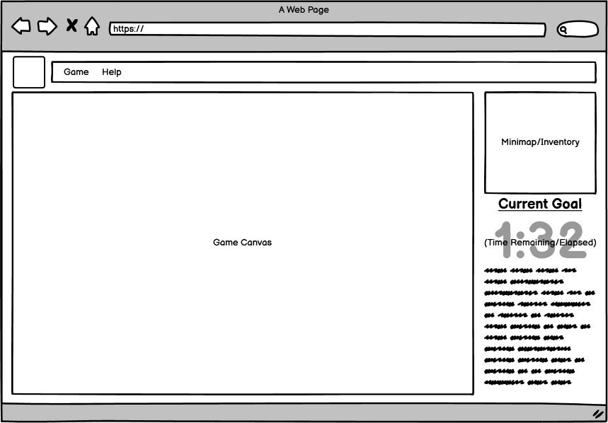

# 

# AMaze.me

AMaze.me is a memory game designed to help improve spatial memory. The idea was inspired by the Mind Field episode ["Your Brain on Tech" (S2:E4)](https://www.youtube.com/watch?v=1RHsAUyFCAM), specifically the maze section. I have also long been fascinated by the early 3D engine techniques used by games such as "Wolfenstein 3D" and "Rise of the Triad", which are uniquely suited for maze, catacomb and dungeon style 3D games. I was curious if I could reimplement the "raycasting" technique myself in Javascript.

AMaze.me requires the player to remember the position of objects in a maze and the route to get to them. They are presented with a random order in which to collect these objects, and judged on time, with the object being to improve their timings. The object is to improve memory while having fun.

[See live project](https://seanyoung247.github.io/Second-milestone-project/) 

## UX (User Experience)

### Project Goals

The project goal is to produce a game that helps improve memory while being fun to play.

### User Stories

- As a **player** I want a **clear explanation** of how to play the game.
- As a **player**, I want an obvious way to **adjust the game** to my level of expertise.
- As a **player**, I want to be able to **learn the game** before I play.
- As a **player**, I want **clear** **feedback** on my goals while I play.
- As a **player**, I want **clear feedback** on my progress while I play.
- As a **player**, I want to get **clear feedback** when I win.

## Design

### Fonts

All fonts are sourced from [google fonts](https://fonts.google.com/).

[Roboto](https://fonts.google.com/specimen/Roboto) is used for site UI and text because it is a simple easy to read font.

[Orbitron](https://fonts.google.com/specimen/Orbitron) is used for the in game title bar clock. This was chosen as it is easy to read and is reminiscent of a digital clock. Only the numbers and ':' character are imported as it is only used for the clock.

[Permanent Marker](https://fonts.google.com/specimen/Permanent+Marker) is used for game generated messages because it is a visually interesting font that lends itself to the "hand drawn" aesthetic of the game.

### Colours

A simple monochromatic colour scheme was chosen for the site UI. This was chosen as it provides strong contrast for interface elements while also being unobtrusive during gameplay.

* Dark grey (#555555) - UI Background
* Light grey (#DDDDDD) - UI Highlights
* White (#FFFFFF) - Text colour

### Original layout

### Final layout

### 

## Features

In this section, you should go over the different parts of your project, and describe each in a sentence or so.

### Existing Features
- Feature 1 - allows users X to achieve Y, by having them fill out Z
- ...

For some/all of your features, you may choose to reference the specific project files that implement them, although this is entirely optional.

In addition, you may also use this section to discuss plans for additional features to be implemented in the future:

### Features Left to Implement
- Another feature idea

## Technologies Used

In this section, you should mention all of the languages, frameworks, libraries, and any other tools that you have used to construct this project. For each, provide its name, a link to its official site and a short sentence of why it was used.

- [JQuery](https://jquery.com)
    - The project uses **JQuery** to simplify DOM manipulation.

### Editors:

- Typora
  - Typora was used to simplify creation of the README.md file.
- Atom
  - Atom was used to write HTML and Javascript code.

## Testing

In this section, you need to convince the assessor that you have conducted enough testing to legitimately believe that the site works well. Essentially, in this part you will want to go over all of your user stories from the UX section and ensure that they all work as intended, with the project providing an easy and straightforward way for the users to achieve their goals.

Whenever it is feasible, prefer to automate your tests, and if you've done so, provide a brief explanation of your approach, link to the test file(s) and explain how to run them.

For any scenarios that have not been automated, test the user stories manually and provide as much detail as is relevant. A particularly useful form for describing your testing process is via scenarios, such as:

1. Contact form:
    1. Go to the "Contact Us" page
    2. Try to submit the empty form and verify that an error message about the required fields appears
    3. Try to submit the form with an invalid email address and verify that a relevant error message appears
    4. Try to submit the form with all inputs valid and verify that a success message appears.

In addition, you should mention in this section how your project looks and works on different browsers and screen sizes.

You should also mention in this section any interesting bugs or problems you discovered during your testing, even if you haven't addressed them yet.

If this section grows too long, you may want to split it off into a separate file and link to it from here.

## Deployment

This section should describe the process you went through to deploy the project to a hosting platform (e.g. GitHub Pages or Heroku).

In particular, you should provide all details of the differences between the deployed version and the development version, if any, including:
- Different values for environment variables (Heroku Config Vars)?
- Different configuration files?
- Separate git branch?

In addition, if it is not obvious, you should also describe how to run your code locally.

## Credits

### Content
- The text for section Y was copied from the [Wikipedia article Z](https://en.wikipedia.org/wiki/Z)

### Media
- The photos used in this site were obtained from ...

### Acknowledgements

- I received inspiration for this project from X
